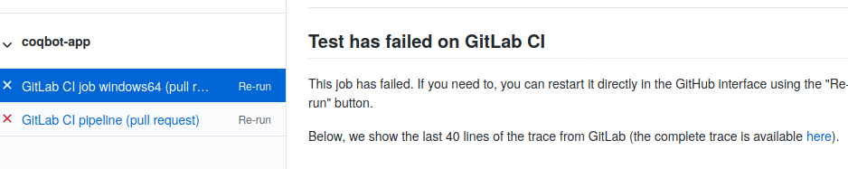
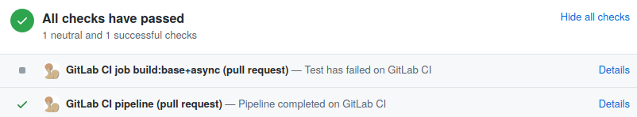
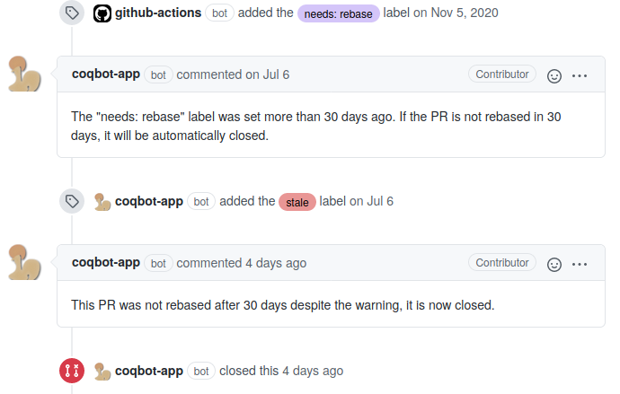

[![Zulip][zulip-badge]][zulip-link]

[zulip-badge]: https://img.shields.io/badge/chat-on%20Zulip-informational.svg
[zulip-link]: https://rocq-prover.zulipchat.com/#narrow/stream/243318-coqbot-devs.20.26.20users

# A multi-function bot, written in OCaml #

Most of the functions of this bot are used in the development of the Rocq Prover.
A subset of functions (most notably the ability to synchronize GitHub
pull requests to GitLab branches and report back the results of
continuous integration) are used in dozens of additional projects.

This is a work in progress and your help is welcome, both in the form
of issues and pull requests.  When reporting a bug or requesting a
feature, please be as specific as possible, and be ready to follow up.
If you are not ready to follow up to make your needs more explicit, or
to help with testing, don't bother requesting a new feature in the
first place.

## Contents ##
1. [Features](#features)
2. [How to use the **@coqbot** instance](#how-to-use-the-coqbot-instance)
3. [Architecture](#architecture)
4. [How to deploy a new instance](#how-to-deploy-a-new-instance)
5. [Building locally](#building-locally)

## Features ##

### Synchronization between GitHub and GitLab ###

GitLab is not just a development platform similar to GitHub, it is
also one of the best CI providers there is today.  Consequently, it is
no surprise that many projects that are developed on GitHub want to
use GitLab for CI/CD.  Since 2018, [GitLab CI/CD supports
GitHub][gitlab-github-support], but this only means mirroring the
repository's branches and reporting status checks back.  Pull requests
originating from forks get no testing, even though this has been a
[feature request][gitlab-fork-issue] for more than two years.

[gitlab-github-support]: https://about.gitlab.com/solutions/github/
[gitlab-fork-issue]: https://gitlab.com/gitlab-org/gitlab-ee/issues/5667

#### Synchronize pull requests from forks ####

This bot works around this issue by pushing new and updated pull
requests to branches on the GitLab mirror.  Note that depending on
your settings this could result in a security risk.  In particular, if
you have secret variables, you should restrict them to protected
branches.  Otherwise, anyone could instrument pull request testing to
get access to their values.


#### Automatic merge commits for testing ####

Like Travis, the bot always create a merge commit of the pull request
head with the head of the base branch, which is very convenient when
the pull request is not up-to-date with the base branch.  If the
automatic merge fails, then the bot will push a failed status check on
the PR and set a "needs: rebase" label (if this labels exists).  It
also removes the label when an updated version without conflicts is
pushed.


#### Detailed failure reporting ####

In the reverse direction, the bot will substitute itself to the status
check reporting that GitLab supports, and report more detailed
information on failing pipelines (with a direct link to the failed
jobs).


Using the status check reporting provided by this bot rather than the
one provided by GitLab is essential, because GitLab wouldn't know how
to report the status back for automatic merge commits.

#### GitHub Checks features ####

When the bot is installed as a [GitHub App](#as-a-github-app), it uses
the GitHub Checks tab for the status reporting.  You get some
additional benefits, like having a snippet of the failed build logs
and the ability to restart failed jobs and pipelines by clicking on
the "Re-run" button.



The GitHub App is also able to report failed jobs in `allow_failure`
mode as "neutral" status checks.



#### Other GitHub-GitLab synchronization features ####

The bot can also add direct link to artifacts generated by the CI to
ease reviewing.  For now, this feature is only activated on the Rocq Prover
repository.  Please open an issue if you would like to use it on your
repository too.


The bot will delete branches corresponding to pull requests when the
pull requests are merged or closed.


Finally, the bot handles some cases of spurious failures by
relaunching the failed job automatically, for instance in case of
runner failure.  At some point in the past, shared runner failures
were very frequent and this feature was absolutely necessary to make
GitLab CI/CD usable in practice.

Please open an issue if you would like any of the behaviors described
above to be configurable.

### Clear milestone of unmerged pull requests ###

When a pull request is closed without being merged, the bot will
remove any milestone that had been set.


Please open an issue if you would like this behavior to be
configurable.

### Mark pull request as stale and automatically close them ###

If this feature is used, the bot will mark pull requests as stale when
they have not been rebased for more than 30 days, with a comment
giving another 30 days to rebase the pull request before it is
automatically closed.



To use the feature, create the `needs: rebase` and the `stale` labels
and set up a cron job (e.g. a scheduled GitHub Action) to call the
`/check-stale-pr` endpoint every day with `owner:repo` in the body.

This feature is best used in combination with a GitHub Action to
automatically add the `needs: rebase` label when a conflict appears
after the base branch has been updated.  Example:

```yml
name: "Check conflicts"
on: [push]
# Only on push because @coqbot already takes care of checking for
# conflicts when PRs are opened or synchronized

jobs:
  main:
    runs-on: ubuntu-latest
    steps:
      - uses: eps1lon/actions-label-merge-conflict@b8bf8341285ec9a4567d4318ba474fee998a6919
        with:
          dirtyLabel: "needs: rebase"
          repoToken: "${{ secrets.GITHUB_TOKEN }}"
```

### Synchronize closed issue's milestone with the one of the pull request that closed it ###

If an issue is closed automatically when merging a pull request, and
this pull request had a milestone set, then the bot will add the issue
to the same milestone.  If the issue was already in a different
milestone, the bot will change the milestone and post a comment
alerting of the change.


This feature won't be activated if you don't select the "issue" event
when configuring the GitHub webhook.  However, it is activated if you
installed the bot as a [GitHub App](#as-a-github-app).  Please open an
issue if you would like this behavior to be configurable.

### Post comment when a pull request does not respect certain standards ###

This feature is only activated on the Rocq Prover repository.  Please open an
issue if you would like to use it on your repository too.

When someone opens a pull request but the name of the branch that was
used to open the pull request is the same as the base branch, the bot
posts a comment recommending to do differently next time, and suggests
reading the contributing guide.


### Manage the backporting process ###

This is a complex feature that is not activated by default, and that
would deserve a whole document to present it.  Please open an issue if
you are interested in hearing about it.


## How to use the **@coqbot** instance ##

### As a GitHub App

This is the recommended installation method, as this is both easier to
set up and it gives access to new features (related to GitHub Checks).

Notes:

- Installation as a GitHub App is still in an experimental stage
and you may frequently receive requests to expand permissions.

- All the repositories that use the bot and belong to the same
owner must install the bot using the same method (GitHub App or
regular user).

- If you were previously using the legacy installation method,
make sure you disable any previously set up GitHub webhooks when
switching to the GitHub App, otherwise the bot will receive every
request twice.

The bot can be installed as a GitHub App to either your account or
organization ([link to app](https://github.com/apps/coqbot-app)).
Once you finish the installation, follow these steps:

- Create a repository on GitLab.com which will be used to run CI jobs.

  By default, the bot will only take care of mirroring the PRs and
  reporting status checks back. So you may still want to activate:

  - either GitLab's mirroring feature for the main branches.
    (A drawback is the
    [sync lag](https://docs.gitlab.com/ee/user/project/repository/mirror/#update-a-mirror)
    (between 5' and 30') that occurs with this pull-based mirroring.)
    If you do so, the easiest way is to choose the "CI/CD for external
    repo" option when creating the GitLab repository.  However, you
    should opt to give the repo by URL rather than with the GitHub
    button, because we won't need GitLab's own status check reporting
    feature. (If it is already activated, you can disable this
    integration in the "Settings" / "Integration" menu).

  - or **@coqbot**'s mirroring feature (it is a push-based mirroring).
    For now, this requires hardcoding the GitHub / GitLab mapping in
    the bot's source code.  Please open an issue if you would like to
    use this feature. We plan to make this configurable in the future.

- In your GitLab repository:

  - go to "Members" to add
    [**@coqbot**](https://gitlab.com/coqbot) as a project member with
    "Developer" role (so that it can push new branches).

  - go to "Settings" / "Webhooks" and create one webhook that will be
    triggered by pipeline events and job events. Set its URL to
    <https://coqbot.herokuapp.com/gitlab>.

  By default, **@coqbot** considers that both GitHub and GitLab repositories
  share the same URL except for the "lab" replacing the "hub" part. If
  that is not the case, assuming you created a GitLab repository whose
  URL is <https://mygitlab.example.com/owner/repo/>, add a file `coqbot.toml` at
  the root of your GitHub repository and in its default branch (most often
  named `master`), containing:
  ```
  [mapping]
  gitlab = "owner/repo"
  gitlab_domain = "mygitlab.example.com"
  ```
  If omitted, the `gitlab_domain` value defaults to `"gitlab.com"`.
  Note that the value of `gitlab_domain` must be a supported GitLab
  instance, i.e., it needs to be defined in the bot's own configuration
  file (check [coqbot-config.toml](coqbot-config.toml) for the coqbot
  instance configuration).

  If you use another instance of **@coqbot**, this repository-specific
  configuration file becomes `BOT_NAME.toml` where `BOT_NAME` is the name
  of the bot.

### As a regular user account (legacy)

The bot used to be given access to each of your GitHub repositories as a
regular GitHub user account (**@coqbot**). This installation method is
still supported for repositories that haven't migrated to the GitHub App
yet. Here are the steps to follow in addition to those described in the 
`As GitHub App` section:

- In your GitHub repository:

  - go to "Settings" / "Manage access" to add
    [**@coqbot**](https://github.com/coqbot) as a collaborator with
    the "Write" role (so that it can push status checks, and set
    labels).

    Currently, every invitation requires a manual validation, so there
    may be some lag before **@coqbot** can push status checks
    to your repository.

  - go to "Settings" / "Webhooks" and add one webhook with URL
    <https://coqbot.herokuapp.com/github> that will only be triggered
    at least by pull request events, and if you want to use the issue
    milestone feature, by issue events as well.  Make sure you change
    the "content/type" value to "application/json".

  

## Architecture ##

The bot has grown according to the needs for automation in the Coq
project, initially as a single file, and is now incrementally being
rearchitected around the idea of providing a library of base bot
components that can be used in a trigger-action programming model.

The most popular trigger-action programming platforms as of today are
IFTTT and Zapier.  Interestingly both of them provide a GitHub
integration, and Zapier provides a GitLab integration as well, but
their integrations do not include sufficiently advanced triggers nor
actions to perform the kind of things that this bot does.

The bot components are of three types (the naming follows [GraphQL's
terminology][graphql-terms] of the corresponding GraphQL requests,
GraphQL requests are preferred to REST requests whenever possible):

- **Subscriptions** are the events that the bot listens to (currently
  GitHub and GitLab webhooks).  See for instance
  `bot-components/GitHub_subscriptions.ml`.

- **Queries** are the requests that are sent to gather additional
  necessary information, and to decide whether the conditions to
  perform an action are met.  See for instance
  `bot-components/GitHub_queries.ml`.

- **Mutations** are the state-changing actions that are performed by
  the bot, in response to some event and some conditions being met.
  See for instance `bot-components/GitHub_mutations.ml`.

[graphql-terms]: https://graphql.github.io/graphql-spec/June2018/#sec-Language.Operations

When this architecture is sufficiently stable, the goal is to publish
the `bot-components` folder as an independent library of building
blocks to create a personalized bot in OCaml.  In the meantime, if you
deploy your own instance, the `callback` function in the `bot.ml` file
is the main entry point, where you can decide of your business
logic by choosing the subscriptions you listen to, and by triggering
the relevant queries and mutations on demand.

## How to deploy a new instance ##

Creating an instance of the bot requires to create a
[GitHub App](https://docs.github.com/en/developers/apps/creating-a-github-app) and set up a server.

### Deploying the server

We provide a Docker image at each release, which can be easily deployed
to [Heroku](https://www.heroku.com/). Simply follow the official
[instructions](https://devcenter.heroku.com/articles/container-registry-and-runtime).

The bot will need to read a few environment variables so make sure
these are configured in your Heroku app:

- `GITHUB_ACCESS_TOKEN` (can also be defined in the configuration file as `github.api_token`)
- `GITLAB_ACCESS_TOKEN` (can also be defined for each GitLab instance through the configuration file as `api_token` or through an environment variable whose name is defined in the configuration file as `api_token_env_var`)
- `GITHUB_WEBHOOK_SECRET` (can also be defined in the configuration file as `github.webhook_secret`)
- `GITLAB_WEBHOOK_SECRET` (can also be defined in the configuration file as `gitlab.webhook_secret`, will default to `GITHUB_WEBHOOK_SECRET` if not defined)
- `DAILY_SCHEDULE_SECRET` (can also be defined in the configuration file as `github.daily_schedule_secret`, will default to `GITHUB_WEBHOOK_SECRET` if not defined)
- `GITHUB_APP_ID` (can also be defined in the configuration file as `github.app_id`)
- `GITHUB_PRIVATE_KEY` (a private key of your GitHub app)
- `PORT` (can also be defined in the configuration file as `server.port`)

Then, you must configure the bot with a configuration file. Here is an example
to adapt to your needs [`example-config.toml`](example-config.toml).

Here is an example of Dockerfile to build a personalized image based
on a release image from GitHub packages, using a custom `bot_config.toml`
configuration file:
```dockerfile
FROM docker.pkg.github.com/coq/bot/coqbot:v0.2.0

COPY path/to/bot_config.toml ./

EXPOSE 8000 # The port you specified in bot_config.toml
            # (this command is ignored if you deploy to Heroku)

CMD ["./bot.exe", "bot_config.toml"]
```
Keep in mind that you should login first to GitHub packages with your
GitHub credentials.

### Create a GitHub App

Please follow the [instructions](https://docs.github.com/en/developers/apps/creating-a-github-app)
for creating a GitHub App.

Make sure to enter the address of your instance of the server followed by `/github` in the
`Webhook URL` entry. It typically looks like `https://myapp.herokuapp.com/github` if you
deployed the server to Heroku.

You can also specify the `Webhook Secret`, which should correspond to the `GITHUB_WEBHOOK_SECRET`
environment variable.

Then, you need to set the following permissions:

- Repository permissions:
  - Checks: read & write
  - Contents: read & write
  - Issues: read & write
  - Metadata: read-only
  - Pull requests: read & write
  - Projects: read & write
  - Commit statuses: read & write

- Organization permissions:
  - Members: read-only
  - Projects: read & write

- Subscribe to events (check the following events):
  - Check run
  - Commit comment
  - Create
  - Issue comment
  - Issues
  - Project
  - Project card
  - Project column
  - Pull request
  - Pull request review
  - Push

## Building locally ##

Instructions for building and testing locally can be found in the
[contributing guide](.github/CONTRIBUTING.md).
